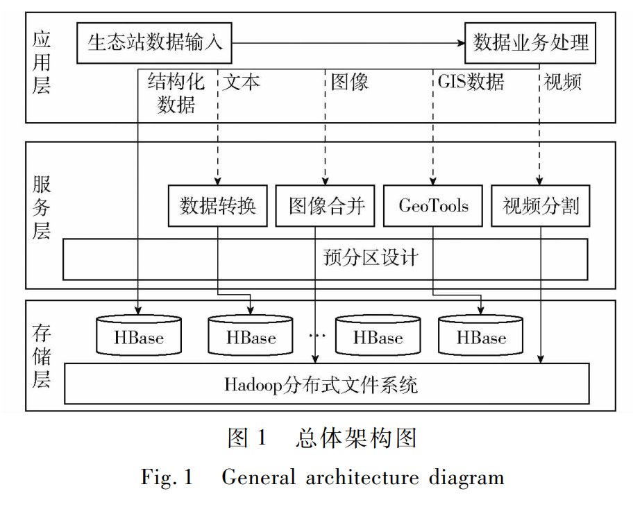

<h1 align="center">Xiangyu Jia | 贾相宇</h1>

Ph.D. Student, Beijing Forestry University 
Remote Sensing Change Detection · Multimodal Large Language Models · Geospatial Big Data

  
  
  

---

## Research Profile

I am a Ph.D. student at Beijing Forestry University, working at the intersection of remote sensing, multimodal learning, and scalable geospatial data systems. My current research focuses on language-guided remote sensing change detection, instruction-conditioned segmentation, and efficient neural architectures for high-resolution Earth observation.

My background combines academic research with industry experience at Meituan and Ant Group, with an emphasis on large-scale data processing, applied AI systems, and remote sensing interpretation.

## Research Interests

- Remote sensing change detection and land-surface dynamics monitoring
- Vision-language reasoning and instruction-conditioned segmentation
- Multimodal large language models for Earth observation
- Lightweight neural networks for high-resolution remote sensing imagery
- Big data storage, indexing, and analytics for forest ecological monitoring

## Education

| Period | Program | Institution |
| --- | --- | --- |
| 2025-2029 | Ph.D. Student | Beijing Forestry University |
| 2019-2022 | M.S. | Beijing Forestry University |
| 2015-2019 | B.S. | Beijing Forestry University |

## Professional Experience

| Period | Organization | Focus |
| --- | --- | --- |
| 2025-Present | Meituan | Applied AI and large-scale data systems |
| 2024-2025 | Ant Group | Data systems and intelligent applications |
| 2022-2024 | Meituan | Big data engineering and applied analytics |

---

## Selected Publications

### Change-LISA: Language-Guided Reasoning for Remote Sensing Change Detection

  

**Xiangyu Jia**, Zhibo Chen, Shengyi Zhang, Xiaojing Xue. 
*IEEE Transactions on Geoscience and Remote Sensing*, Early Access, 2026. 
[DOI: 10.1109/TGRS.2026.3684817](https://doi.org/10.1109/TGRS.2026.3684817) · [IEEE Xplore](https://ieeexplore.ieee.org/document/11482624) · [Code](https://github.com/jxy0413/changeLisa)

This work studies instruction-conditioned remote sensing change detection, where a model produces change masks according to natural-language queries and suppresses false positives under counterfactual instructions. It introduces ReasonRS-110K and proposes Change-LISA, a parameter-efficient multimodal framework that combines a Siamese SAM encoder, explicit difference modeling, and an LLM-guided mask decoder.

### CSGANet: Lightweight Channel-Split Group Attention for High-Resolution Remote Sensing Change Detection

  

**Xiangyu Jia**, Zhibo Chen, Shengyi Zhang. 
*IEEE Journal of Selected Topics in Applied Earth Observations and Remote Sensing*, 2026, pp. 1-15. 
[DOI: 10.1109/JSTARS.2026.3659056](https://doi.org/10.1109/JSTARS.2026.3659056) · [IEEE Xplore](https://ieeexplore.ieee.org/document/11367786) · [Code](https://github.com/jxy0413/csganet)

This paper develops a compact Siamese architecture for remote sensing change detection. The method integrates channel-split group attention and adaptive path mixing to balance local, directional, and global context while preserving boundary details under a lightweight computational budget.

### 森林生态站大数据快速存储与索引方法

  

Fast Storage and Indexing Method of Big Data in Forest Ecological Station. 
王新阳, **贾相宇**, 陈志治, 崔晓晖, 许福. 
*农业机械学报* (*Transactions of the Chinese Society for Agricultural Machinery*), 2021, 52(8): 195-204. 
[DOI: 10.6041/j.issn.1000-1298.2021.08.019](https://doi.org/10.6041/j.issn.1000-1298.2021.08.019)

This study designs a Hadoop- and HBase-based storage framework for heterogeneous forest ecological station data, including images, videos, GIS data, and ecological indicators. It improves data distribution, RowKey-based retrieval, and secondary non-primary-key indexing with Elasticsearch.

---

## Technical Expertise

- **Programming:** Python, Java, Scala, SQL
- **Machine Learning:** PyTorch, TensorFlow, Hugging Face, OpenCV, scikit-learn
- **Remote Sensing & GIS:** GDAL, QGIS, Google Earth Engine
- **Big Data Systems:** Hadoop, HBase, Spark, Flink, Kafka, Hive, Elasticsearch, ClickHouse
- **Engineering Tools:** Git, Docker, Kubernetes, Linux, Jupyter

## Contact

  
  

   
  WeChat: scan the QR code to connect.

---

  

