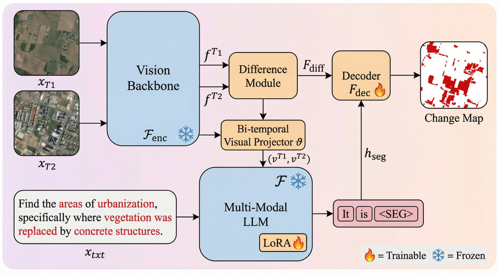

<!-- 动态打字效果 -->

<!-- 社交媒体徽章 -->

<!-- 访客计数器 -->

---

## 🧑‍💻 About Me

### 🎓 Education
- 🎓 **PhD Student** @ Beijing Forestry University (2025 - 2029)
- 🎓 **Master's Degree** @ Beijing Forestry University (2019 - 2022)
- 🎓 **Bachelor's Degree** @ Beijing Forestry University (2015 - 2019)

### 💼 Work Experience
- 🏢 **Meituan 美团** (2025 - Present)
- 🏢 **Ant Group 蚂蚁集团** (2024 - 2025)
- 🏢 **Meituan 美团** (2022 - 2024)

### 🔭 Current Focus
- 🤖 **Large Language Models (LLM)** - 大模型研究与应用
- 🛰️ **Remote Sensing Change Detection** - 遥感变化检测
- 📊 **Big Data Analytics** - 大数据分析与处理

---

## 📚 Publications

<table>
<tr>
<td width="80" align="center">

 

 
<b>2026</b>
</td>
<td>

**Change-LISA: Language-Guided Reasoning for Remote Sensing Change Detection**

  

📖 <b>IEEE Transactions on Geoscience and Remote Sensing (TGRS)</b>, 2026, Early Access
 
👥 <b>Xiangyu Jia (贾相宇)</b>, Zhibo Chen, Shengyi Zhang, Xiaojing Xue
 
🏛️ Beijing Forestry University
 
🔗 DOI: <a href="https://doi.org/10.1109/TGRS.2026.3684817">10.1109/TGRS.2026.3684817</a> | 
📄 <a href="https://ieeexplore.ieee.org/document/11482624">IEEE Xplore</a> | 
💻 <a href="https://github.com/jxy0413/changeLisa">Code</a>

📝 摘要 | Abstract

 
Remote sensing change detection (RSCD) is widely used for monitoring land-surface dynamics. Most models, however, output an unconditional "all-changes" map and do not account for user intents expressed in natural language. This can lead to spurious masks under counterfactual (i.e., negative/mismatched) queries. This paper studies language-guided reasoning change detection. Given a bitemporal image pair and a text instruction, the model outputs an instruction-conditioned change mask; the correct output can be an empty mask when the queried change is absent. To support this setting, ReasonRS-110K is built as a benchmark of <b>112,317</b> image–instruction–mask triplets. Instructions are organized into hierarchical reasoning levels (L1–L3) together with L0 negative queries for compliance evaluation. Change-LISA is proposed as a parameter-efficient framework that combines a frozen Siamese SAM encoder and an explicit difference/fusion module with a multimodal LLM (LLaVA). The LLM emits a token whose embedding prompts a lightweight mask decoder. Only LoRA adapters and the decoder are optimized. On ReasonRS-110K, Change-LISA reaches <b>63.1 IoU</b> and <b>77.3 F1</b> on positive-query levels (L1–L3) and <b>95.4 NCA</b> with <b>0.12 FPA</b> on L0 negative queries, outperforming representative CD-only, RIS, and MLLM baselines.

</td>
</tr>
<tr>
<td width="80" align="center">

 

 
<b>2026</b>
</td>
<td>

**CSGANet: Lightweight Channel-Split Group Attention for High-Resolution Remote Sensing Change Detection**

  

📖 <b>IEEE Journal of Selected Topics in Applied Earth Observations and Remote Sensing (JSTARS)</b>, 2026, pp. 1-15
 
👥 <b>Xiangyu Jia (贾相宇)</b>, Zhibo Chen, Shengyi Zhang
 
🏛️ Beijing Forestry University
 
🔗 DOI: <a href="https://doi.org/10.1109/JSTARS.2026.3659056">10.1109/JSTARS.2026.3659056</a> | 
📄 <a href="https://ieeexplore.ieee.org/document/11367786">IEEE Xplore</a> | 
💻 <a href="https://github.com/jxy0413/csganet">Code</a>

📝 摘要 | Abstract

 
Change detection (CD) in remote sensing imagery is a fundamental tool for Earth monitoring. We propose CSGANet, a lightweight Siamese framework featuring two key innovations: a channel-split group attention module (CSGA) to selectively integrate complementary local, directional, and global contexts, and an Adaptive PathMixing Module (AdmPM) for globally guided, boundary-preserving downsampling. Extensive experiments on LEVIR, SYSU, and S2Looking benchmarks demonstrate that CSGANet achieves competitive accuracy with a compact footprint, reaching F1 scores of <b>91.82%</b>, <b>84.26%</b>, and <b>66.11%</b>, respectively, with only <b>4.15M</b> parameters and <b>16.39 GFLOPs</b>.

</td>
</tr>
<tr>
<td width="80" align="center">

 
<b>2021</b>
</td>
<td>

**森林生态站大数据快速存储与索引方法**

Fast Storage and Indexing Method of Big Data in Forest Ecological Station

📖 农业机械学报 (Transactions of the Chinese Society for Agricultural Machinery), 2021, 52(8): 195-204
 
👥 王新阳, <b>贾相宇</b>, 陈志治, 崔晓晖, 许福
 
🏛️ 北京林业大学信息学院 | 国家林业和草原局林业智能信息处理工程技术研究中心
 
🔗 DOI: <a href="https://doi.org/10.6041/j.issn.1000-1298.2021.08.019">10.6041/j.issn.1000-1298.2021.08.019</a>

📝 摘要 | Abstract

 
针对森林生态站中大量图像、视频、GIS数据等非结构化数据以及生态指标等结构化数据存储效率低、检索性能差的问题，提出了基于Hadoop和HBase的森林生态站大数据存储框架。设计预分区算法保证数据在集群中均匀分布，科学设计RowKey实现生态数据的快速检索，基于ElasticSearch的二级非主键索引技术优化多条件检索。实验结果表明，系统检索速度提升3.99倍，每秒查询数提升1.88倍，系统响应时间降低69.5%。

</td>
</tr>
</table>

---

## 🛠️ Tech Stack

### 💻 Languages

### 🤖 AI & Machine Learning

### 📊 Big Data

### 🛰️ Remote Sensing & GIS

### ⚙️ Backend & Database

### 🔧 Tools & Platforms

---

## 📊 GitHub Stats

  

---

## 🤝 Let's Connect

---

### 🌟 From Industry to Academia, Pursuing the Dream of Technology

**美团 → 蚂蚁集团 → 美团 → PhD @ 北京林业大学**

